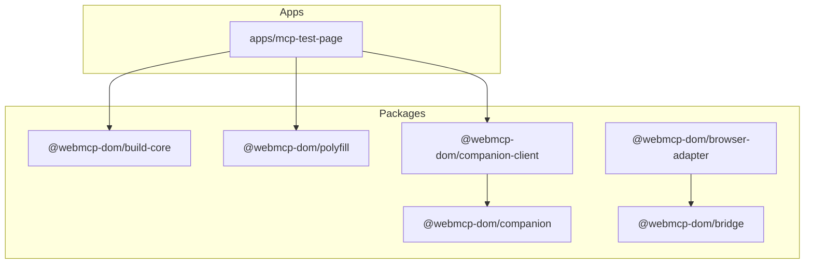
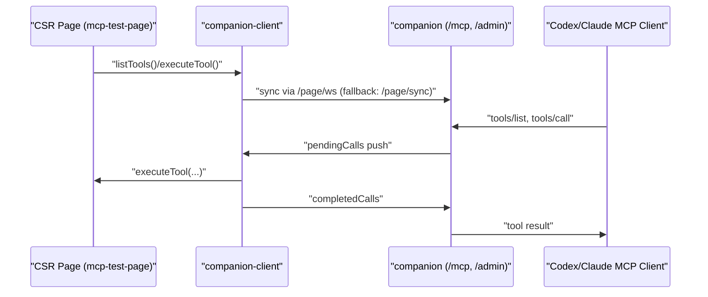

# webmcp-dom-suite

WebMCP 선언형 DOM 컴파일러/런타임/브리지 + 앱을 함께 관리하는 모노레포입니다.

## 패키지

- `@webmcp-dom/build-core`: `data-mcp-*` DSL 컴파일 + manifest 생성 + 런타임 등록기
- `@webmcp-dom/polyfill`: strict core `navigator.modelContext` 폴리필
- `@webmcp-dom/companion`: 로컬 단일 동반앱(MCP + 내장 admin UI)
- `@webmcp-dom/companion-client`: CSR 페이지 <-> companion 동기화 SDK
- `@webmcp-dom/bridge`: Streamable HTTP ↔ stdio MCP 브리지
- `@webmcp-dom/browser-adapter`: SDK 기반 stdio MCP 어댑터(브라우저 relay endpoint 포워딩)

## 앱

- `apps/mcp-test-page`: 선언형 DOM -> 툴 등록 흐름 검증용 Vite React 페이지

## 구조 다이어그램





## 개발

```bash
pnpm install
pnpm run typecheck
pnpm run test
pnpm run build
pnpm run test:bundlers
pnpm run build:apps
```

## 앱 실행

```bash
pnpm run dev:companion
pnpm run dev:mcp-test
```

## 그룹 DSL 핵심 규칙

- 버튼/타겟 필수: `data-mcp-action`, `data-mcp-name`, `data-mcp-desc`
- 그룹 컨테이너 선택: `data-mcp-group`
- 그룹/툴 메타(선택):
  - `data-mcp-group-name`
  - `data-mcp-group-desc`
  - `data-mcp-tool-name`
  - `data-mcp-tool-desc`
- 중첩 그룹 규칙: **가장 가까운 상위 `data-mcp-group` 소속 (nearest group wins)**
